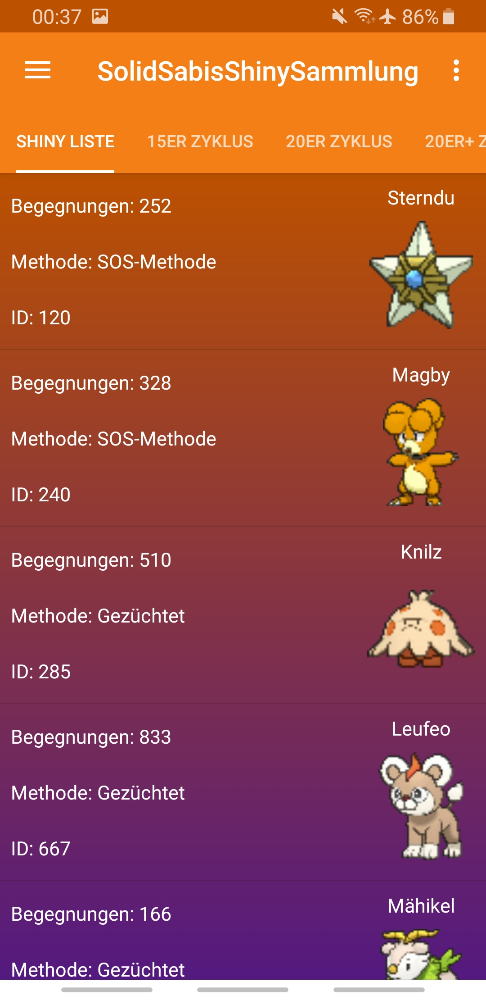
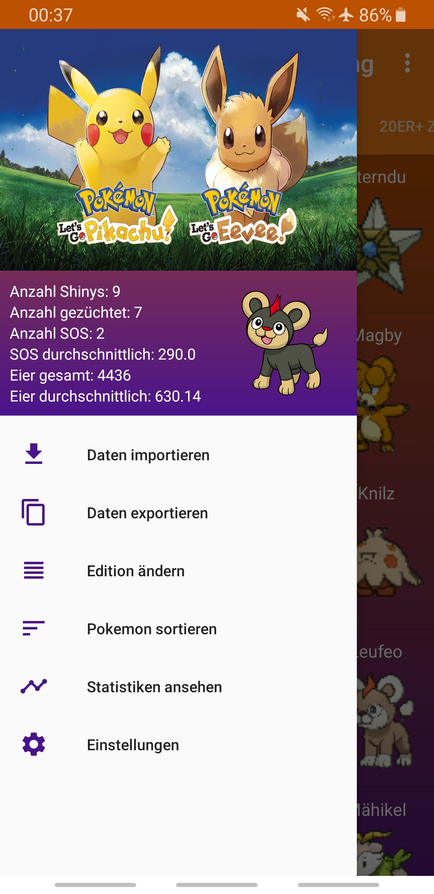
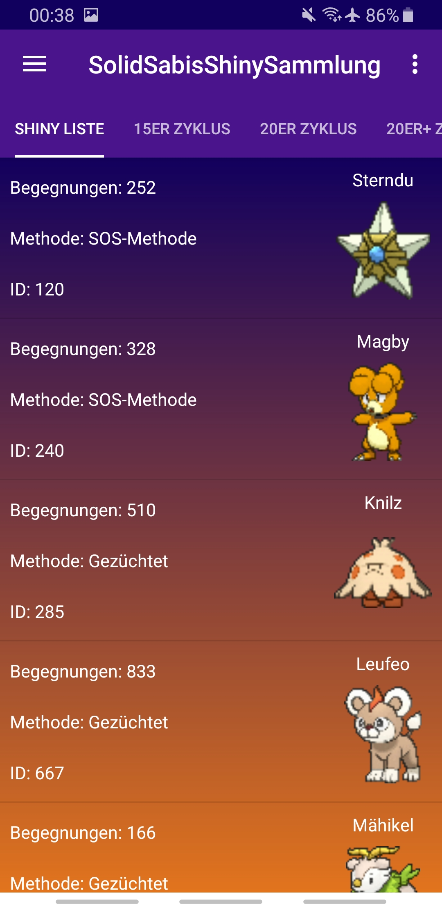
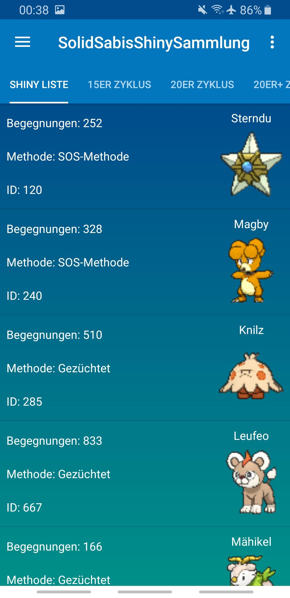
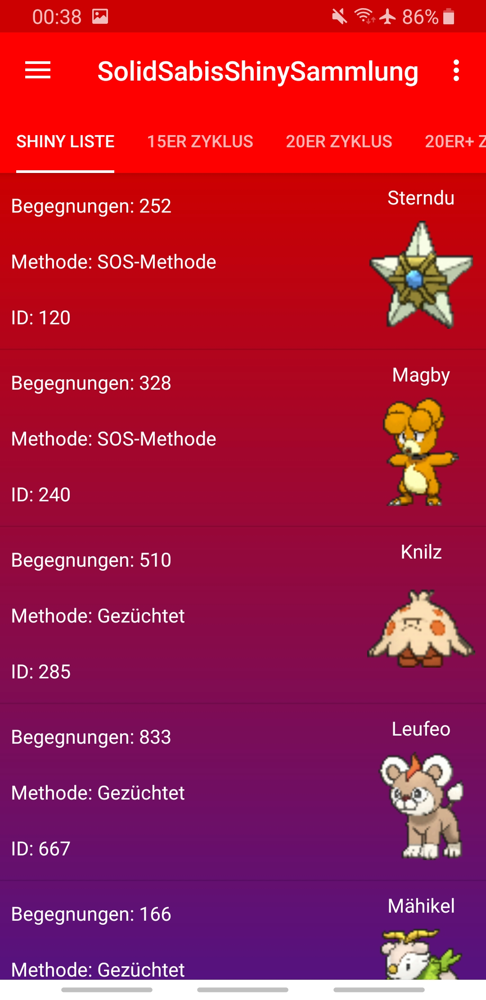
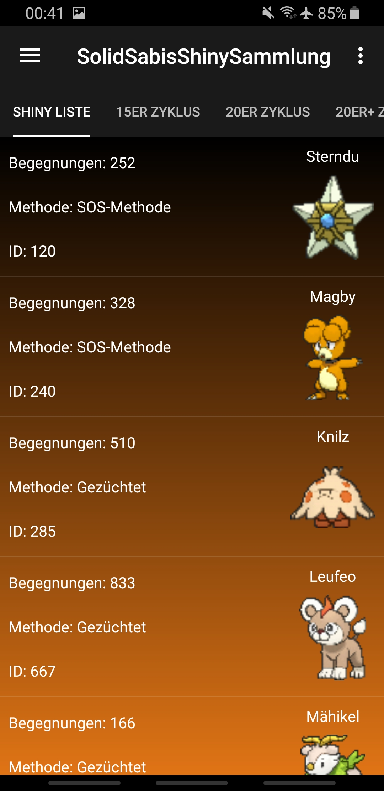

# ShinyCollection

This is an Android application for managing data about your shiny pokemon and some interesting statistics.

## Features
- wish lists for your future shiny pokemon, including a counter for your encounters
- add pokemon to your wish list, hunt it, and move it to your shiny list!
- pokemon name auto completion when adding a new pokemon
- export your data to your clipboard, either compressed or not compressed
- import previously exported data, must be copied to clipboard
- 4 different color themes as light and dark theme (= 8 themes in total)
- pokemon images are downloaded from a freely accessable online database and cached locally on your device

## Supported Languages
- English
- German

